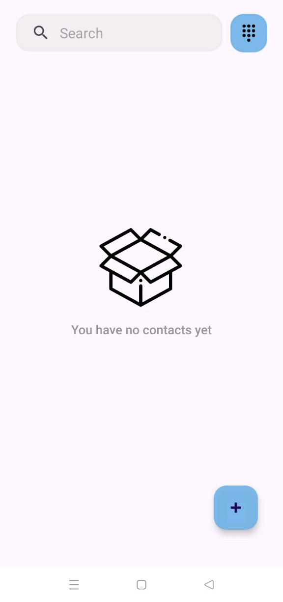
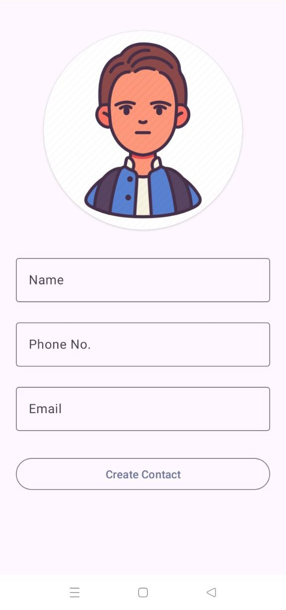
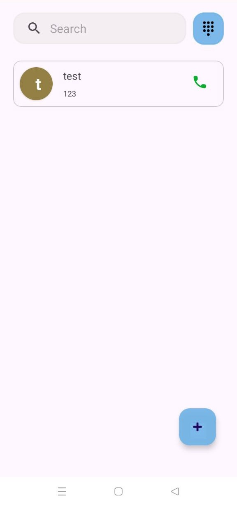

# Contact App

Welcome to the Contact App repository! This Android application is designed to help users manage their contacts efficiently. Whether you need to store phone numbers, email addresses, or profile images, this app has got you covered. With its intuitive interface and handy features, managing contacts has never been easier.

## Features

- **Contact Management:** Store contact details including names, phone numbers, email addresses, and profile images.
- **Swipe to Call:** Initiate a call by simply swiping right on a contact.
- **Search Functionality:** Easily find contacts by searching their names or phone numbers.
- **Real-time Information:** Retrieve real-time contact information whenever you need it.

## Screenshots

Here are some screenshots of the Shayari App:

    

## Download

You can download the latest version of the Contact App from the link below:

[Download Contact App APK](#) 

## Installation

To install the Contact App, follow these steps:

1. Download the APK file from the link provided above.
2. Open the downloaded file on your Android device.
3. Follow the on-screen instructions to install the app.
4. Once installed, you can start using the Contact App to manage your contacts efficiently.

